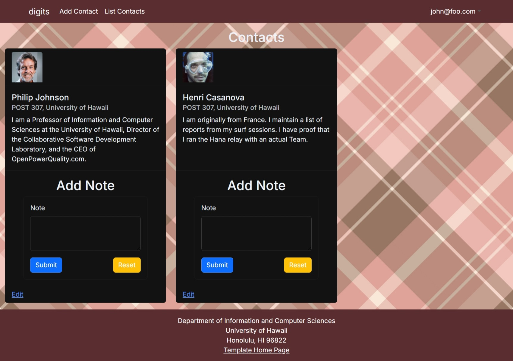
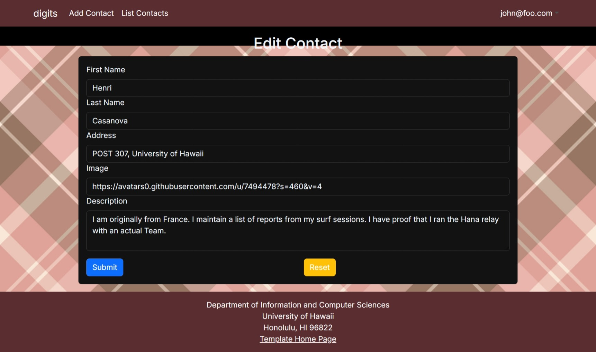

<!-- ========================= -->
<!-- Digits Project Home Page -->
<!-- ========================= -->

<h1>Digits</h1>

  Welcome to <strong>Digits</strong> — a simple, secure web application designed to help users manage and organize their personal contact information.  
  It demonstrates user authentication, protected routes, and full CRUD (Create, Read, Update, Delete) functionality using a modern web stack.

<!-- ========================= -->
<!-- Screenshot of Landing Page -->
<!-- ========================= -->

  

<!-- ========================= -->
<!-- Installation Instructions -->
<!-- ========================= -->
<h2>Installation Instructions</h2>

  Follow these steps to set up and run the <strong>Digits</strong> application locally:

<ol>
  <li><strong>Clone the repository</strong> 
    Open your terminal and run:
    <pre><code>git clone &lt;your-repo-url&gt;</code></pre>
  </li>

  <li><strong>Navigate to the project directory</strong> 
    <pre><code>cd digits</code></pre>
  </li>

  <li><strong>Install dependencies</strong> 
    Make sure you have <code>Node.js</code> installed, then run:
    <pre><code>npm install</code></pre>
  </li>

  <li><strong>Set up your environment variables</strong> 
    Create a <code>.env</code> file in the root directory and include your database connection string or other environment variables as needed.
  </li>

  <li><strong>Run the development server</strong> 
    <pre><code>npm run dev</code></pre>
  </li>

  <li><strong>Open the app in your browser</strong> 
    Visit <a href="http://localhost:3000" target="_blank">http://localhost:3000</a> to view the application.
  </li>
</ol>

  Once running, you can create an account, log in, and begin adding or editing contacts.

<!-- ========================= -->
<!-- Walkthrough Section -->
<!-- ========================= -->
<section id="walkthrough">
  <h2>Walkthrough</h2>

  <!-- Landing Page -->
  <h3>Landing Page</h3>
  

    
  

  

    The landing page introduces the Digits application and provides navigation options for signing in or registering a new account.
    If the user is not logged in, this is the only accessible page.
  

  <!-- Sign In Page -->
  <h3>Sign In Page</h3>
  

    
  

  

    Existing users can log in by entering their email and password. Once successfully signed in, users are redirected to the Home page.
  

  <!-- Sign Up Page -->
  <h3>Sign Up Page</h3>
  

    
  

  

    New users can register by providing their name, email, and password. After registration, users can immediately sign in to start adding and managing their contacts.
  

  <!-- Home Page -->
  <h3>Home Page </h3>
  

    
  

  

    After logging in, it will take you to your home page and the navbar will contain links to list contact and add new contacts.
  

  <!-- Add Contact Page -->
  <h3>Add Contact Page</h3>
  

    
  

  

    The Add Contact page allows users to create a new contact by entering:
  

  <ul>
    <li>Name</li>
    <li>Address</li>
    <li>Phone number</li>
    <li>Email address</li>
  </ul>
  

    Once submitted, the new contact is saved and displayed on the Home page.
  

  <!-- Notes Page -->
  <h3>Notes Page</h3>
  

    
  

  

    The Notes page serves as a simple section where users can create or view personal notes. 
    For this example, the page just displays a short message (“hi”), but it can easily be expanded to include more interactive features such as saving or editing notes in future versions.
  

  <!-- Edit Contact Page -->
  <h3>Edit Contact Page</h3>
  

    
  

  

    The Edit Contact page allows users to update an existing contact’s information. 
    After saving changes, the updated details are instantly reflected on the Home page.
  

  <!-- Admin Page -->
  <h3>Admin Page</h3>
  

    
  

  

    The Admin page is only accessible to administrators. 
    It displays all contacts created by every user in the system, allowing admins to review and manage data to maintain organization and security.
  

  <!-- Summary -->
  <h2>Summary</h2>
  

    Digits is a clean and secure contact management application that allows users to store, edit, and manage contact information efficiently.
    It demonstrates authentication, protected routes, and full CRUD (Create, Read, Update, Delete) functionality.
  

  

    With its user-friendly interface and intuitive layout, Digits provides an excellent example of a modern web-based contact management system.
  

</section>

